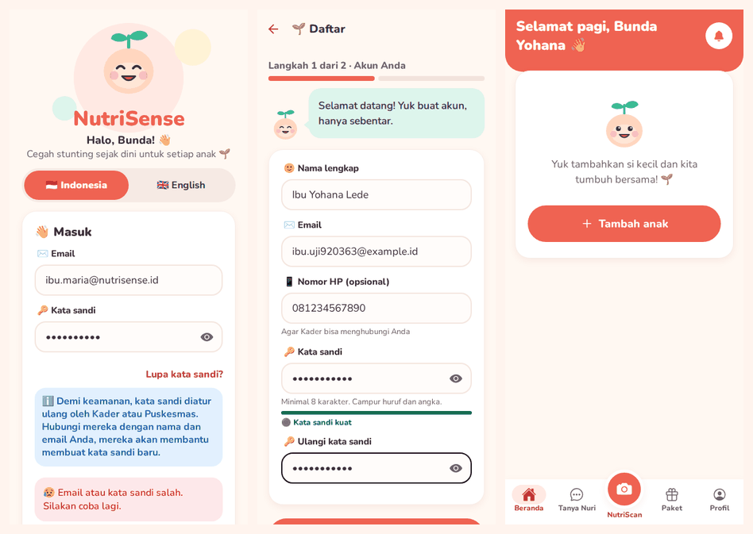
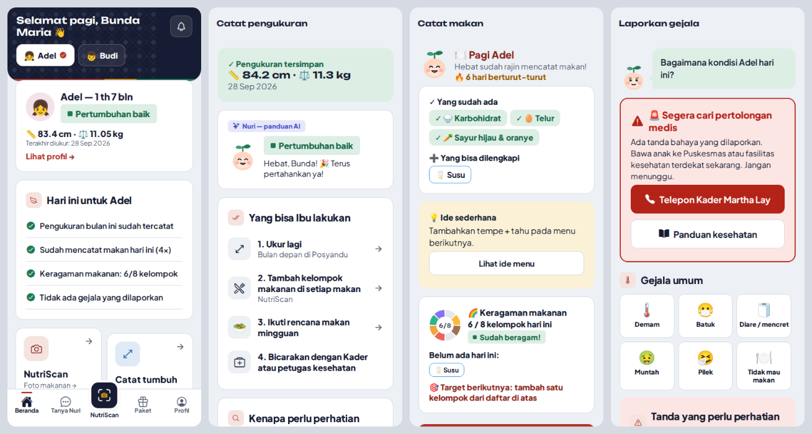
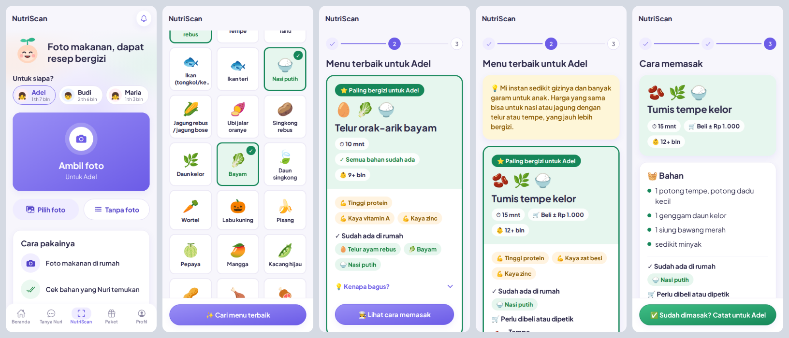
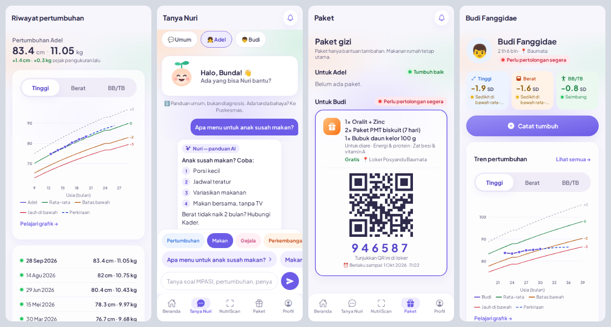
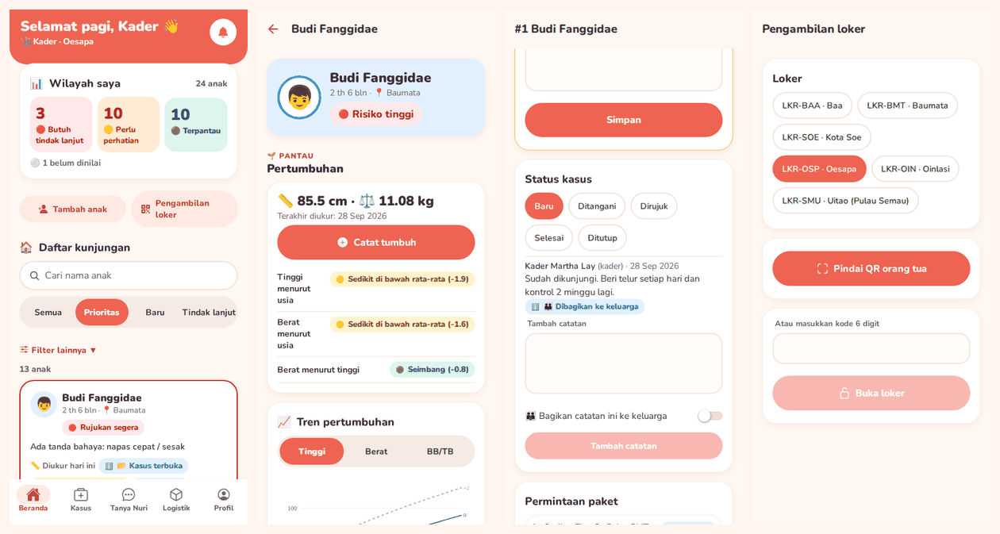
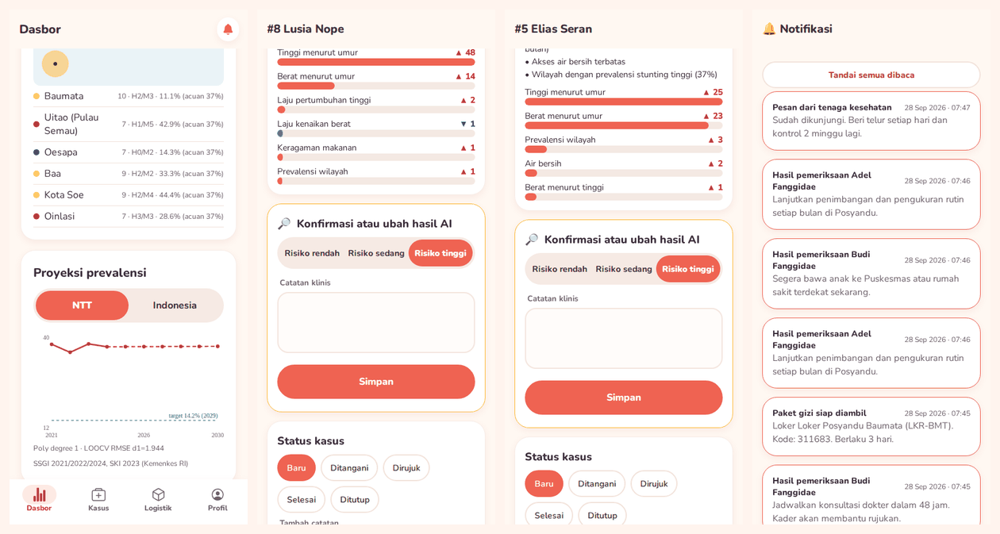

# NutriSense user guide

How to start NutriSense and use it as a mother, a Kader, a health officer or a doctor.
The app's screens are in Bahasa Indonesia by default. Labels below are written the way they appear in the app, with English in brackets where helpful. You can switch to English on the login screen or in **Profil → Pengaturan**.

- [1. Start the app](#1-start-the-app)
- [2. Log in or sign up](#2-log-in-or-sign-up)
- [3. Mothers and caregivers](#3-mothers-and-caregivers)
- [4. Kaders](#4-kaders)
- [5. Health officers and doctors](#5-health-officers-and-doctors)
- [6. Good to know](#6-good-to-know)

## 1. Start the app

NutriSense has two parts: the **server** (backend) and the **app**. Use a hosted link if you have one (see [Put it online](../README.md#put-it-online)). Otherwise run both on your own computer. You need Python 3.11 and Node.js 22.

**Terminal 1: the server**
```bash
cd backend
python3 -m venv .venv && source .venv/bin/activate    # Windows: .venv\Scripts\activate
pip install -r requirements-dev.txt                    # first time only
uvicorn app.main:app --host 0.0.0.0 --port 8000
```
The first start takes about 20 seconds. It creates demo data (49 children and 15 pregnancies in East Nusa Tenggara, 6 lockers and 2 supply hubs) and trains the risk model.

**Terminal 2: the app**
```bash
cd mobile
npm install          # first time only
npx expo start
```
- **On a phone:** install **Expo Go** from the Play Store or App Store and scan the QR code. The phone and the computer must be on the same Wi-Fi.
- **In a browser:** press `w` in the same terminal.
- **If the phone cannot connect:** on the login screen tap ⚙️ **Alamat server** (server address) and enter the computer's address, for example `http://192.168.1.10:8000`.

## 2. Log in or sign up



- **Demo accounts** are listed on the login screen. Tap one to fill it in. The password for all of them is `Demo1234!`.

  | Account | Role |
  |---|---|
  | `ibu.maria@nutrisense.id` | Mother of Adel and Budi |
  | `kader.oesapa@nutrisense.id` | Kader Martha Lay, Oesapa |
  | `officer@nutrisense.id` | Dinas Kesehatan officer |
  | `doctor@nutrisense.id` | Doctor |

- **New mother account:** tap **Daftar sebagai Ibu / pengasuh** (sign up as a mother / caregiver).
  1. **Akun Anda:** name, email, phone (optional) and a password. The meter shows how strong the password is.
  2. **Wilayah & izin:** pick your village, then choose permissions. Only the first one, for recording your child's data, is required.
- **Kader, officer and doctor accounts** are created by the Dinas Kesehatan administrator. Self sign-up is not available for these roles.
- **Forgot your password?** Ask your Kader or the Puskesmas to reset it.

## 3. Mothers and caregivers

Tabs at the bottom: **Beranda** (home) · **Tanya Nuri** (ask Nuri) · **NutriScan** · **Paket** (packages) · **Profil**.



### Every day: Beranda
- Pick your child at the top.
- Your child's card shows the status and the latest height and weight. Tap it to open your child's page.
- **Untuk hari ini** (for today) lists what to do today. A green ✓ means done. An orange ! means it still needs doing: tap the line to do it.
- Four quick actions: **Catat makan** (log a meal), **Catat tumbuh** (measure), **Cek gejala** (check symptoms) and **Tanya Nuri**.
- **Jelajahi fitur** (explore features): tap a card to open it. **Pantau pertumbuhan** has measuring, growth history and development; **Makan & gizi** has NutriScan, meal logging, the meal plan and recipes; **Bantuan & saran** has symptoms, Tanya Nuri and the health guide; **Paket gizi** opens your packages.
- To add a child, tap **+** next to your children's names.

### Measure your child: Catat tumbuh
Four steps:
1. Choose lying down (under 2 years) or standing.
2. Read how to measure.
3. Enter weight and length/height. The app warns you if a number looks wrong.
4. Check the numbers and save.

The result is in plain words, for example 🟢 *Pertumbuhan baik* (growing well), 🟡 *Perlu dipantau* (keep an eye on it) or 🟠 *Perlu perhatian* (needs attention). Below it is **Yang bisa dilakukan** (what you can do), one short line each. Tap **Lihat alasan** (see reasons) for the reasons; **Detail analisis** there shows the AI numbers.

### NutriScan: from a photo of your food to a healthy recipe



Tap **NutriScan** in the middle of the tab bar. Then:

1. **Foto makanan** (photo your food): pick your child under **Untuk siapa?** if you have more than one, then take a photo of the food or ingredients you have at home, e.g. eggs, spinach and rice. You can also tap **Pilih foto** (choose a photo), or **Tanpa foto** (no photo) and pick the foods yourself.
2. **Yang ada di piring** (what's on the plate): Nuri shows the foods it recognised as big tiles with a green ✓.
   - Tap a tile to add or remove a food, then tap **Cari menu terbaik** (find the best dish).
   - Recognising foods in a photo needs the Claude AI key on the server. Without it, the app says so, and you tap the foods you can see in your photo instead.
3. **Menu untuk …** (dish for …): ⭐ **Cocok untuk …**, the most nourishing dish you can make from these foods. It shows:
   - minutes and the youngest age, and **Semua bahan tersedia** (everything is at home) or the estimated cost of what to buy;
   - small tags such as *Protein tinggi*; tap **Kenapa bagus?** (why is it good?) for the reasons;
   - a tip when a food is not a good choice for a child, e.g. instant noodles, with a cheap better option;
   - **Menu lain** (other dishes).
4. **Lihat resep** (see recipe): **Bahan** (ingredients, in spoons and handfuls), **Sudah ada di rumah** and **Perlu dibeli atau dipetik** (to buy or pick, with price and where; leaves like moringa are often free from a garden), then **Cara membuat**, short numbered steps. Every recipe uses cheap foods from the kiosk, market or garden, and most take 20 minutes or less.
5. **✓ Sudah dimasak? Catat** (cooked it? log it): saves the dish in your child's meal log. This also updates today's food variety score (aim for 5 of 8 food groups).

The dishes are chosen for your child's age and for the nutrients your child has been short of this week. Prices are rough estimates for NTT markets and kiosks and may differ.

**Catat makan** (log a meal) is separate: use it to record what your child ate without looking for a recipe. It is a quick action on Beranda, or **Catat tanpa foto** at the bottom of NutriScan.

### When your child is sick: Cek gejala
- Tap the symptoms, or type how your child is in your own words, e.g. *"anaknya diare 2 hari, lemas sekali"*.
- Symptoms are in two groups: **Gejala umum** (common) and **Tanda bahaya** (danger signs).
- 🚨 If there is a danger sign, the app shows **Perlu pertolongan** (needs help now) with **Hubungi Kader** (call your Kader) and **Lihat panduan** (see the guide). Go to the Puskesmas right away.
- **Panduan kesehatan** (health guide) lists the danger signs and basic care. It works without internet.



### Your child's page
Tap your child's card on Beranda. From top to bottom:

- name, age and status;
- three tiles for **Tinggi**, **Berat** and **BB/TB** (height, weight, weight-for-height): the number in SD, and in words underneath;
- **Tren pertumbuhan** (growth chart), with **Pelajari grafik** (learn the chart) and **Lihat semua** for the full history;
- Nuri's short result and **Yang bisa dilakukan** (what you can do);
- **Perkembangan** (development): ✓ on track, ● keep an eye on it. Tap it for the checklist and play ideas;
- shortcuts for NutriScan, meal logging, the meal plan and recipes, and your stickers;
- **Tim …**, the care team, and any note a Kader or doctor shared with you;
- **Data & privasi** at the bottom: export, privacy settings, delete.

**Riwayat pertumbuhan** (growth history) shows the latest height and weight, the change since last time, the chart and every measurement.

### Ask a question: Tanya Nuri
Choose a topic (**Pertumbuhan** growth, **Makan** eating, **Gejala** symptoms, **Perkembangan** development). Tap a suggested question or type your own. Nuri answers in a few short numbered points, with **Lihat panduan lengkap** (see the full guide) underneath. The answers are general guidance, not a medical diagnosis.

### Pregnancy check-ups from the Puskesmas: Hubungkan ke Puskesmas
If you are pregnant, your check-up results can come into the app by themselves.
1. Open your pregnancy page (Beranda → **Bunda** → the pregnancy card). On the **Hubungkan ke Puskesmas** card, read the consent and tap **Ya, saya setuju**.
2. You get a code such as **NS-7KQ2MP**. At every check-up, show it to the midwife: tap **Tunjukkan QR ke bidan**. The code also shows under "Periksa hamil" on Beranda, and it works without signal.
3. After the check-up, the Puskesmas system sends your results. You get a notification, the K visit is ticked "masuk otomatis", and **Hasil dari Puskesmas** shows each value in plain words (tekanan darah, kadar darah, lingkar lengan, detak jantung janin…). If something needs attention, for example high blood pressure, the page says what to do and has a **Hubungi bidan** button.
4. To stop, open **Hasil dari Puskesmas** → **Matikan hubungan ke Puskesmas**. Earlier results stay; if you switch it on again you get a new code.

Your Kader and health workers can see the results, but never your code. Doctors and officers can try the Puskesmas side in **Profil → Portal Puskesmas (demo)**.

### Packages: Paket
- **Paket gizi** shows the packages for each child (**Untuk …**): what is in it, what it is for, that it is free, the locker, and where it is on its way.
- To collect a package, show the **QR code** or tell the **6-digit code** at the locker.
- Packages are extra support. They are not required.

### Your account: Profil → Pengaturan
Change your name, phone, village, password, language and **text size** (Normal, Besar or Sangat besar). **Data & privasi** has one switch per permission and a **Simpan** (save) button. **Pelajari penggunaan data** (learn how data is used) shows what is shared and with whom.

## 4. Kaders

Tabs: **Beranda** · **Kasus** (cases) · **Tanya Nuri** · **Logistik** · **Profil**.



- **Wilayah saya** (my area) counts the children who need follow-up (red), need attention (orange) or are on track (green). Tap a count to see those children.
- **Prioritas kunjungan** (visit priorities) lists children most urgent first: name, village and status.
  - Search by name.
  - Filter by **Semua** (all), **Prioritas**, **Baru** (new) or **Tindak lanjut** (follow-up).
  - **Filter lainnya** filters by village, risk, last measured, or children who need a visit.
  - Tap a child (**Lihat →**) to open their page, with the reasons and history.
- **Measure a child** from the child's page, the same way a mother does. Measurements taken without signal are sent later.
- **Kasus:**
  - Check an AI result: you can confirm or raise it. Only a doctor or officer can lower a high-risk result.
  - Write a note. Turn on 👪 **Bagikan catatan ini ke keluarga** (share this note with the family) and the mother sees it on her child's page as a health worker recommendation.
- **Pengambilan loker** (locker pickup): scan the mother's QR code, or type her 6-digit code, to open the locker.

## 5. Health officers and doctors



- **Dasbor** (dashboard): children, stunting rate, urgent cases, the village map, the stunting forecast and how well the AI model performs.
- **Kasus:** results the AI flagged for checking. Set the correct risk level and add a clinical note.
- **Logistik → Permintaan paket** (package requests): open a request to see every way to deliver it: stock in a nearby locker, or road delivery from a supply hub. The app explains why each one is or isn't possible, then **Setujui** (approve). Doctors approve items that need a prescription.
- **Logistik → Loker** (lockers): stock in each locker and hub, with a restock button when an item runs low.

## 6. Good to know

- **No signal?** Measurements, meals and symptoms are saved on the phone and sent automatically later. A banner shows what is waiting and says ✓ *Data berhasil disinkronkan* when everything is sent.
- **Shared phone?** Logging out removes that account's saved pages and unsent data from the phone. The app warns you first if something has not been sent yet.
- **AI:**
  - Everything works without an AI key except photo NutriScan and free-form Tanya Nuri answers.
  - To turn those on, put `NUTRISENSE_ANTHROPIC_API_KEY=...` in `backend/.env` and restart the server.
  - The risk model is trained on simulated children. Treat its results as decision support, not a diagnosis. Every result screen says so.
- **Start over with fresh demo data:** stop the server, delete `backend/nutrisense.db`, and start it again.
